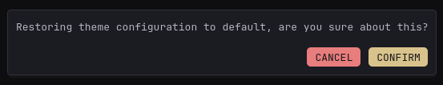

[⇐ addon-script list](../#addon-scripts)

Just a basic dialog box, this will be an optional dependency for other addon script since there's already a native `confirm`. Only useful if you prefer the layout to at least match Glance's styling.



# Dependency
- [CREATE_ELEMENT](../global-functions/CREATE_ELEMENT.js) *(required)*

# How to load
```html
  <!-- Dependencies goes here -->
  
  <link rel="preload" href="/assets/glance-addon-scripts/custom-dialog/style.css?v=1" as="style" onload="this.onload=null;this.rel='stylesheet'">
  <script defer src="/assets/glance-addon-scripts/custom-dialog/script.js?v=1"></script>
```
