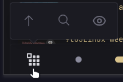

[⇐ Micro-script list](../#micro-scripts)

This simply adds a custom menu to the navigation bar. And will be used for other micro-scripts in future that may have user interactable elements like [Glimpse](../glimpse).




### Note
`post-glance.js` is loaded a bit differently as it needs to have a delay before it is executed.

```js
setTimeout(() => {
  $include: custom-menu/post-glance.js
}, 50);
```
