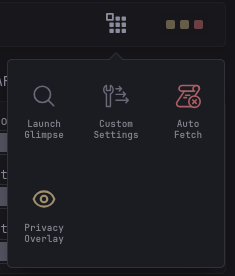

[⇐ addon-script list](../#addon-scripts)

This simply adds a custom menu to the navigation bar. And will be used for other addon-scripts in future that may have user interactable elements like [Glimpse](../glimpse).



# Dependency
- [CREATE_ELEMENT](../global-functions/CREATE_ELEMENT.js) *(required)*
- [Toast Message](../toast-message) *(optional)*

# How to load
```html
  <!-- Dependencies goes here -->
  
  <link rel="preload" href="/assets/glance-addon-scripts/custom-menu/style.css?v=1" as="style" onload="this.onload=null;this.rel='stylesheet'">
  <script src="/assets/glance-addon-scripts/custom-menu/script.js?v=1"></script>
```

# Usage
```js
window.createCustomMenuItemElement?.({
  className: 'class-of-the-menu',
  label: 'Label',
  tooltip: 'Tooltip on icon hover',
  icon: '', //  or <svg> or text only
  actionFn: (e) => {}, //on icon click function
  
  // By default, items are sorted alphabetically by className.
  // Menu with `order` will be prioritized and sorted first.
  order: 9,
  
  dismissOnClick: true, // closes the menu after selection. `true` by default
});
```

# Credits
Vectors and icons by [SVG Repo](https://www.svgrepo.com).