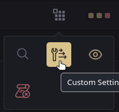
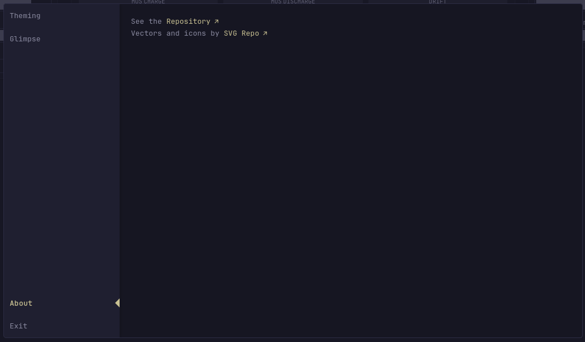

[⇐ addon-script list](../#addon-scripts)

On its own it does nothing, this will be used for other addon-scripts that may need a custom settings like [Glimpse](../glimpse).




# Dependency
- [CREATE_ELEMENT](../global-functions/CREATE_ELEMENT.js) *(required)*
- [Toast Message](../toast-message) *(required)*
- [Custom Menu](../custom-menu) *(required)* — adds the launch button
- [Modal](../modal) *(required)* - Used as the element to add contents to
- [Custom Dialog](../custom-dialog) *(optional)* - Falls back to `window.confirm` dialog

# How to load
Read the main [README.md](https://github.com/ralphocdol/glance-addon-scripts/blob/main/README.md#loading-script) on how to properly load this.
```html
  <!-- Dependencies goes here -->
  
  <link rel="preload" href="/assets/glance-addon-scripts/custom-settings/style.css?v=1" as="style" onload="this.onload=null;this.rel='stylesheet'">
  <script defer src="/assets/glance-addon-scripts/custom-settings/script.js?v=1"></script>
```

# Usage
Needs to be in loaded after the Glance is completely loaded. See other widgets that used this as this can be complicated.

## Structure
```javascript
  while (!document.body.classList.contains('page-columns-transitioned')) await new Promise(resolve => setTimeout(resolve, 50));
  
  window.createCustomSettingsItem?.({
    nameHTML: 'Name of Settings',
    contentObject: [
      { type: 'toggle', name: 'A toggle button', key: 'action-of-the-button', value: true, colOffset: 1 },
      { type: 'text', name: 'A text field', key: 'action-of-its-save-button' value: 'The current value', tooltip: 'If needed' }
    ],
    contentEventListener: {
      // Every function here has access to the following:
      // _SETTING_ELEMENT_    = this is the main element, the parent element
      // _KEY_                = the key of the element, mainly used for class of the parent element
      // _KEYED_ELEMENT_      = query's the element by key from contentObject 
      // _SET_KEYED_ELEMENT_  = sets the properties of the keyed element (value, checked, title and more)
      // _SET_SLIDER_LABEL_   = for slider type, updates the label on the right side
      // 
      // Every function cannot access anything outside of window.createCustomSettingsItem
       
      
      
      setup: () => {
        // a custom function
        
        // Scripts here are the shared across other eventListeners,
        // this is where you initialize a variable or a functions
        const var1 = 'I am a variable from setup()';
      },
      ready: () => {
        // a custom function
        
        // Scripts here are launched once on load, sure you can add
        // this to the setup() but this is more isolated with IIFE
        // and will not share anything to other events
      },
      cleanup: () => {
        // a custom function

        // This function runs after you click away from this settings.
      },
      click: () => {
        // this is a built in event type and will look and work like 
        // addEventListener('click', () => {});
        
        // This is also isolated with IIFE so it will not share anything 
        // outside this event, similar to other event native to addEventListener
      }
    }
  });
```

# Credits
Vectors and icons by [SVG Repo](https://www.svgrepo.com).