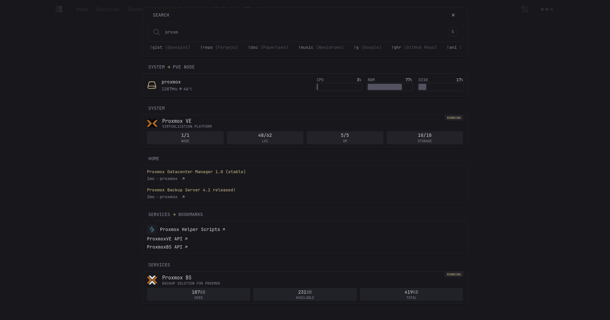
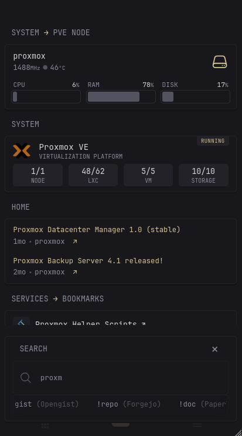
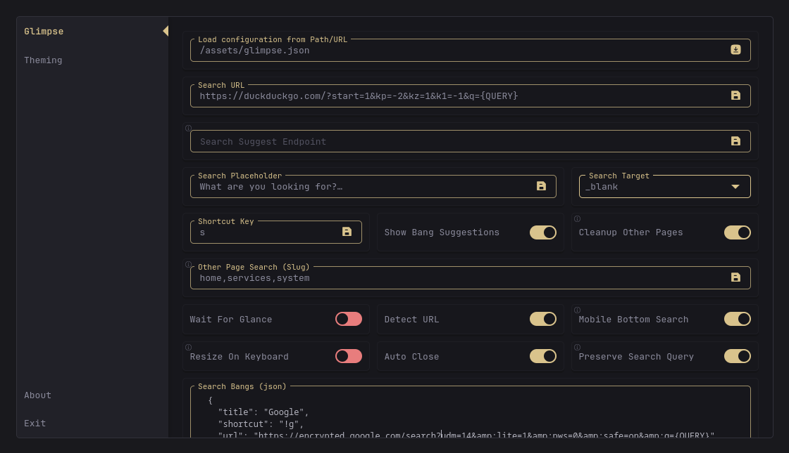

[⇐ addon-script list](../#addon-scripts)

This adds a way to search through your widgets—similar to Quick Launch from [Homepage](https://gethomepage.dev/configs/settings/#quick-launch). There's an open [feature request](https://github.com/glanceapp/glance/issues/133#issuecomment-2159504258) for native support, but until then, this provides a workaround.





# Dependency
- [CREATE_ELEMENT](../global-functions/CREATE_ELEMENT.js) *(required)*
- [Custom Menu](../custom-menu) *(required)* — adds the launch button inside the custom menu instead
- [Custom Settings](../custom-settings) *(required)* — adds a custom-settings, must have the `Custom Menu` to work. Your modified configurations are ONLY available in wherever browser you modified them to, it does NOT have a sync functionality. This utilizes your browser's `localStorage`.

# How to load
Read the main [README.md](https://github.com/ralphocdol/glance-addon-scripts/blob/main/README.md#loading-script) on how to properly load this.
```html
  <!-- Dependencies goes here -->
  
  <link rel="preload" href="/assets/glance-addon-scripts/glimpse/style.css?v=1" as="style" onload="this.onload=null;this.rel='stylesheet'">
  <script defer src="/assets/glance-addon-scripts/glimpse/script.js?v=1"></script>
```

# Limitations
- Only the Docker, Monitor, and recurring HTML structure widgets like RSS are supported. 
- If you have a `custom-api`, `extension`, or `html` widget that uses the same HTML structure, you can simply add the property `css-class: glimpsable`.
- Popovers and similar elements do not work on searched widgets. The scripts have already been initialized and cannot be reinitialized.

# Configurations
## Setting up
Copy the [config.json](config.json) to your `/assets` path, rename and load them in the `custom-settings` addon of Glimpse.

## Search Suggestion
Due to [some limitations](https://developer.mozilla.org/en-US/docs/Web/HTTP/Guides/CORS) and the fact this is a client script, you'll need to proxy external search suggestions (e.g., from DuckDuckGo or Google) using a service like your own Node.js server.

For `searchSuggest.endpoint`, use the URL of your proxy endpoint. If you're using a self-hosted instance like whoogle, the endpoint would be `/autocomplete?q=` or searxng `/autocompleter?q=`, so you would set it like this: `https://your-domain.com/autocompleter?q=`.

## Other page search
```jsonc
{
  // ...
  "otherPages": {
    "slugs": [],
    "useIframe": false,
    "cleanUp": true
  }
  // ...
}
```

### slugs
By default, Glimpse searches only the currently loaded page. To include other pages, set the `otherPages.slug` array variable with your primary page's slug and any additional pages.

Slugs are used instead of titles or page names since they can be [custom-defined](https://github.com/glanceapp/glance/blob/v0.8.4/docs/configuration.md#slug).

The current page where Glimpse was launched will still be prioritized and shown first.

### useIframe
When `false`, will use the Glance's API endpoint `/api/pages/${slug}/content` to get the HTML of the page. This has no way of loading JavaScript itself since it will just be an HTML element which is why it's a lot lighter and faster.
When `true`, will use an `iframe` element and load the `/${slug}` directly inside it. This uses more resources but have more accurate layout. Layout that depends on JavaScript like:
```html
  <div data-dynamic-relative-time="1700055000"></div>
```
will not be handled properly and would return empty.

### cleanUp
Each page slugs' pages are stored in the DOM once per page load when you do a search, this does increase the resource usage if you have `useIframe` set to `true`. Setting the `cleanUp` to `false` will store those pages for the next time you do a query but will only do so if the page haven't changed.

## Detect URL
To detect and open the searched query as a URL instead.
Set the `detectUrl.enabled` to `true`.

### Allowed CIDR and Host
A list of CIDR's or Hosts to be detected as a URL
```jsonc
{
  // ...
  "allowedCidrHosts": [
    "*.home.local",   // will match glance.home.local
    "192.168.0.0/12"  // will match 192.168.21.2:8080
  ]
  // ...
```

## Custom layout
> [!CAUTION]
>
> Still Experimental, there will be accuracy issues for complex layouts.
> And this is subject to change a lot...

You can use the class `glimpsable-custom-list` for custom HTML layouts, along with attributes `glimpse-list` and `glimpse-item`.
```yml
css-class: glimpsable-custom-list
template: |
    <ul glimpse-list>
        <li glimpse-item>1</li>
        <li glimpse-item>2</li>
    </ul>
```
or with `glimpsable-custom` with attribute `glimpse`.
```yml
css-class: glimpsable-custom
template: |
    <div glimpse>
        Some searchable string
    </div>
```

### Exclusions
Add this property to your widget if you don't want a specific widget to be searched:
```yml
css-class: glimpsable-hidden
```

### Duplicate Handling
If you reuse widgets with Glimpse support across multiple pages with `$include` that is within `pagesSlug`, they may appear more than once in your Glimpse results. To avoid duplicates, add this to your widget's `css-class` property:
```yml
css-class: glimpse-unique-some-unique-name
```
***Tip**: The class must start with `glimpse-unique-` to be recognized.
Choose a unique suffix to keep it distinctly identifiable.*

## Other Configuration Options
| Key           | Description |
|---------------------|--------------------------|
| `cleanupOtherPages` | Whether to clean the iframes or not. Can lead to high usage if set to `false` but could otherwise speed up your widget queries |
| `glimpseKey` | The shortcut key to call Glimpse, set to empty `''` by default to disable. *Setting this to `'s'` will override Glance's default search key focus* |
| `waitForGlance` | Setting this to `false` will make the search and search-bangs functionality of Glance not work as those are loaded after Glance is ready, Glimpse functionality will remain working. This just limits when the `glimpseKey` can be triggered |
| `showBangSuggest` | Suggests your defined `bang`s |
| `mobileBottomSearch` | Repositions the search bar and the suggestions to the bottom for ease of access. |
| `resizeOnSoftKeyboardOpen` | On most mobile browsers when, a soft keyboard is present, the page will just overlay making the entire content scrollable. This will result in disabled horizontal scroll of content near the soft keyboard making the `mobileBottomSearch` suggestions not scrollable. This attempts to fix that by making the content resized instead. |
| `autoClose` | Automatically closes Glimpse on search submit (enter) |
| `preserveQuery` | Preserves search query |