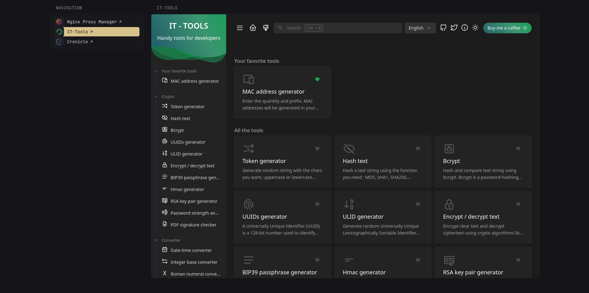

[⇐ addon-script list](../#addon-scripts)

This turns your bookmarks into a navigation when paired with an `iframe`.



# How to load
```html
  <link rel="preload" href="/assets/glance-addon-scripts/iframe-bookmarks-nav/style.css?v=1" as="style" onload="this.onload=null;this.rel='stylesheet'">
  <script defer src="/assets/glance-addon-scripts/iframe-bookmark-nav/script.js?v=1"></script>
```

# Get started
Pair the `css-class` of the widget `bookmarks` and `iframe`:
`iframe-links-id-of-class` and `iframe-page-id-of-class`, `id-of-class` should be unique per pair.

Basic setup
```yaml
- name: Pages
  columns:
    - size: small
      widgets:
        - type: bookmarks
          css-class: iframe-links-id-of-class
          groups:
            - links:
                - title: Nginx Proxy Manager
                  url: https://nginx.home.local
                - title: IT-Tools
                  url: https://it-tools.home.local
    - size: full
      widgets:
        - type: iframe
          title: Nginx Proxy Manager
          title-url: https://nginx.home.local
          source: https://nginx.home.local
          css-class: iframe-page-id-of-class
          height: 800
          cache: 30s
```

This also assumes the first bookmark is the one opened by default.

# Credits
[caesarbishop](https://discord.com/users/258104994270543873) - for the idea