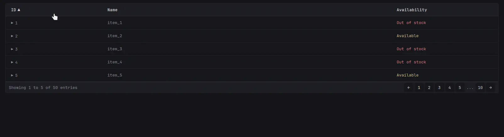

[⇐ addon-script list](../#addon-scripts)

### Desktop


### Mobile


# Limitations
This is a client-only implementation—**no server-side support**—because of how Glance is structured and how scripts are delivered.

> [!WARNING]
>
> Large datasets are **strongly discouraged**. All data is initially rendered into the DOM before this Script removes and stores it in memory.
>
> Pagination limits what’s shown, but the full dataset remains in your browser. This can lead to major slowdowns or even browser crashes.
>
> Performance is acceptable with up to ~50–100 entries on most systems. Beyond that, behavior may vary depending on device and data complexity.

# Usage
## Structure Layout
```html
<div responsive-table>          <!-- Main table container -->
    <div table-header>          <!-- Table header container -->
        <div>Header 1</div>     <!-- Each column header -->
    </div>
    <div table-body>            <!-- Row items container -->
        <div table-row>         <!-- Container of each cell of the row -->
            <div>Item 1</div>   <!-- The Cell item, must match header count -->
        </div>
    </div>
</div>
```

## Structure Info
`responsive-table`

A lightweight component for rendering responsive, paginated data tables using custom headers and rows.

**Attributes**
- `paginate`: Enables paginated layout for the table.
- `row-limit`: Defines the maximum number of visible rows per page. Requires `paginate` to be enabled.
- `row-limit-mobile`: Overrides `row-limit` on mobile devices. Requires `paginate` to be enabled.

**Child Elements**
- `table-header`

    **Attributes (per column)**
    - `sortable`: Enables sorting on the column.
    - `data-width`: Defines the column’s proportional width (e.g., `3` for `3fr`).
    - `sort-default-asc` / `sort-default-desc`: Sets the default sort order to ascending or descending, respectively. These are mutually exclusive—only one of them should be used. If both are present, only the first column with either attribute takes effect.

- `table-body`: Contains the list of data rows.

    **Child Elements**
    - `table-row`: Represents a single data row.

        **Attributes (per cell)**
        - `data-show-on-mobile`: By default, every cell is collapsed on mobile. Set this to make them visible instead.
        - `data-as-mobile-title`: Marks this cell as the row’s title on mobile views.
        - `data-as-collapsed-column`: Moves this cell into a collapsible section on desktop views.
        - `data-to-sort`: Useful when a cell contains complex DOM that interferes with normal sorting behavior.

All rows must maintain the same number of cells as defined in the header.

## Alternative style
Glance includes a built-in collapsible-container you can use directly inside `table-body`. It automatically handles content collapsing and expands on demand.
```html
<div table-body class="list collapsible-container" data-collapse-after="5"></div>
```
Set `data-collapse-after` to control how many items show before collapsing.


## Example
```html
<div responsive-table paginate row-limit="5" row-limit-mobile="3">
    <div table-header>
        <div sortable>ID</div>
        <div sortable data-width="3">Name</div>
        <div sortable>Price</div>
        <div sortable sort-default-asc>Availability</div>
    </div>
    <div table-body>
        <div table-row>
            <div>1</div>
            <div data-as-mobile-title>item_1</div>
            <div data-as-collapsed-column>$10.00</div>
            <div data-show-on-mobile class="color-positive">Available</div>
        </div>
        <div table-row>
            <div>2</div>
            <div data-as-mobile-title>item_2</div>
            <div data-as-collapsed-column>$15.00</div>
            <div data-show-on-mobile class="color-negative">Out of stock</div>
        </div>
    </div>
</div>
```