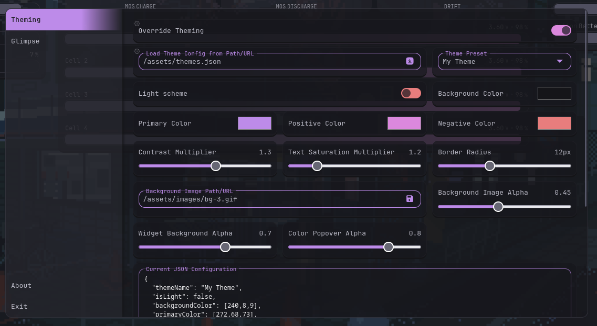
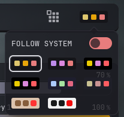

[⇐ addon-script list](../#addon-scripts)

This will replace Glance's default theming and will do more than just change colors.




> [!NOTE]
>
> 1. This is a client-side functionality, all modifications will only be stored in the browser.
> 2. There is no syncing, you can only fetch a configuration.
> 3. Config fetching using URL will mostly not work unless you proxy it or have full control over it.


> [!WARNING]
>
> 1. Using the Widget Background Blur is GPU-intensive!
> 2. Background Image should be set to a reasonable limit, 1920×1080 (max 2560px wide), under 1 MB. Beyond these may affect performance

# Dependency
- [CREATE_ELEMENT](../global-functions/CREATE_ELEMENT.js) *(required)*
- [Custom Settings](../custom-settings) *(required)* — where the configuration can be modified, `inherits dependency`.

# How to load
```html
  <!-- Dependencies -->
  
  <link rel="stylesheet" href="/assets/scripts/theming/style.css?v=1">
  <script defer src="/assets/path-to-addon-script/theming/script.js?v=1"></script>
```

# Get started
Just enable `Override Theming` in `custom-settings` as shown in the preview above.

To get started, just copy the [sample-themes.json](sample-themes.json) to your `assets-path` and enter that path in the `Load Theme Config From Path/URL`.

# Broken after update?
Clear your local configuration in `localStorage` or just uncomment this line of code.
```js
  localStorage.setItem(configKey, '');
```
Refresh your Glance page. Remember to comment it back if that fixed your issue.

# Credits
[svilenmarkov](https://github.com/svilenmarkov) - https://github.com/glanceapp/glance/discussions/184