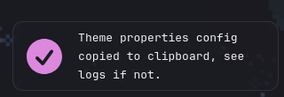
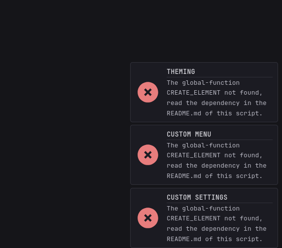

[⇐ addon-script list](../#addon-scripts)

Adds a toast notification and is optionally used by some addon-scripts.




# Usage
```js
window.showToast?.('This is a message');
window.showToast?.('This is a success message', { type: 'success' });
window.showToast?.('This is an error message', { type: 'error' });
window.showToast?.('This is message has a title', { title: 'Title' });
window.showToast?.('Everything else', { 
  title: 'Title',
  type: 'info',
  position: 'bottom-right', // and bottom-left only, other position blocks the contents
  duration: 3000, // ms is the default
});
```